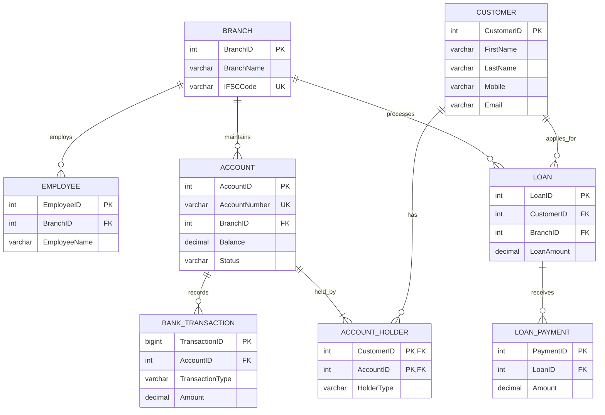

# Project KASHI — ER diagram

Paste this Mermaid code into https://mermaid.live and export as PNG/SVG for the report.

```mermaid
erDiagram
    BRANCH ||--o{ EMPLOYEE : employs
    BRANCH ||--o{ ACCOUNT : maintains
    CUSTOMER ||--o{ ACCOUNT_HOLDER : has
    ACCOUNT ||--|{ ACCOUNT_HOLDER : held_by
    ACCOUNT ||--o{ BANK_TRANSACTION : records
    CUSTOMER ||--o{ LOAN : applies_for
    BRANCH ||--o{ LOAN : processes
    LOAN ||--o{ LOAN_PAYMENT : receives

    CUSTOMER {
      int CustomerID PK
      varchar FirstName
      varchar LastName
      varchar Mobile
      varchar Email
    }
    BRANCH {
      int BranchID PK
      varchar BranchName
      varchar IFSCCode UK
    }
    EMPLOYEE {
      int EmployeeID PK
      int BranchID FK
      varchar EmployeeName
    }
    ACCOUNT {
      int AccountID PK
      varchar AccountNumber UK
      int BranchID FK
      decimal Balance
      varchar Status
    }
    ACCOUNT_HOLDER {
      int CustomerID PK, FK
      int AccountID PK, FK
      varchar HolderType
    }
    BANK_TRANSACTION {
      bigint TransactionID PK
      int AccountID FK
      varchar TransactionType
      decimal Amount
    }
    LOAN {
      int LoanID PK
      int CustomerID FK
      int BranchID FK
      decimal LoanAmount
    }
    LOAN_PAYMENT {
      int PaymentID PK
      int LoanID FK
      decimal Amount
    }
```
